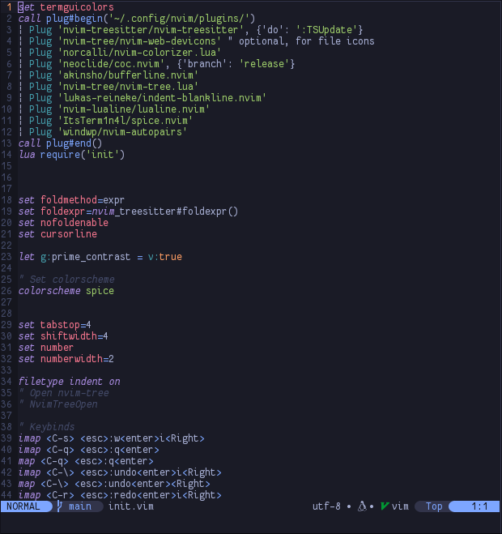
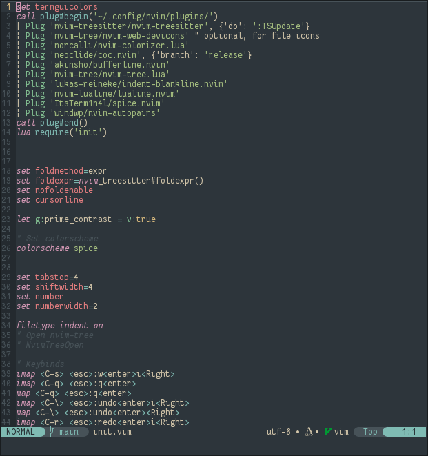
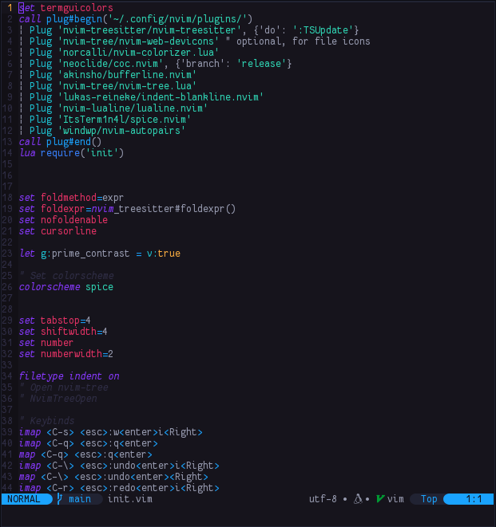
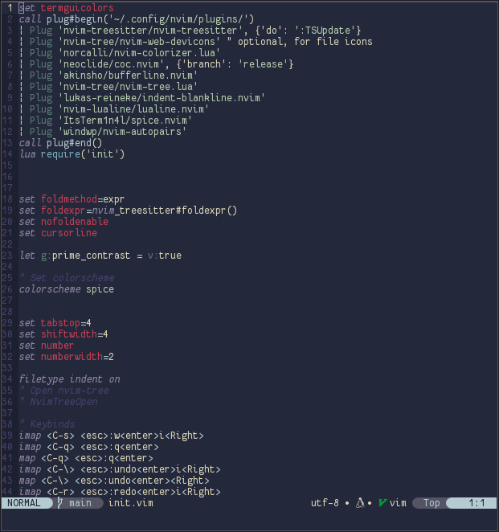
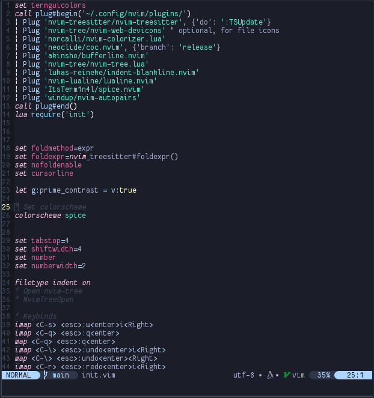

# ItsTerm1n4l/Spice.nvim

___
My awesome [Neovim](https://github.com/neovim/neovim) theme for use with [Spice](https://github.com/ItsTerm1n4l/Spice), my automatic colorscheme setter.    
Using the amazing [tokyonight.nvim](https://github.com/folke/tokyonight.nvim) as a base.    

### **Installation**
To install with [nvim-plug]()
Add 
```
Plug 'ItsTerm1n4l/spice.nvim'   
```
to `init.nvim`    
To install with [lazy.nvim](https://github.com/folke/lazy.nvim)
```
{
  "ItsTerm1n4l/spice.nvim",
  lazy = false,
  priority = 1000,
  opts = {},
}
```
And add    
```
colorscheme spice
```
to `init.nvim`

### **More Screenshots**
<details>
<summary>(Click to expand)</summary>

Tokyo-night theme.   


Everforest theme.   


Monokai theme.   


Kanagawa-storm theme.   


Poimandres theme.   

</details>
