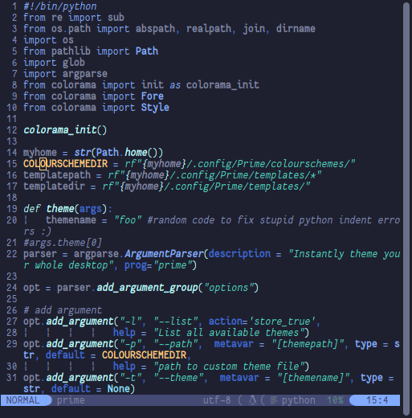

# ItsTerm1n4l/prime.nvim

   
Screenshot taken with Moonlight theme.
___
based off [shaunsingh/prime.nvim](https://github.com/shaunsingh/prime.nvim)

### **More Screenshots**
<details>
<summary>(Click to expand)</summary>

Tokyo-night theme.   


Everforest theme.   


Kanagawa-storm theme.   


</details>

## Features

prime.nvim is meant to be a modern colorscheme written in lua for NeoVim that supports a lot of the new features
added to NeoVim like built-in LSP and [TreeSitter](https://github.com/nvim-treesitter/nvim-treesitter)

+ Supported plugins:
  + [TreeSitter](https://github.com/nvim-treesitter/nvim-treesitter)
  + [LSP Diagnostics](https://neovim.io/doc/user/lsp.html)
  + [Lsp Saga](https://github.com/glepnir/lspsaga.nvim)
  + [LSP Trouble](https://github.com/folke/lsp-trouble.nvim)
  + [Git Gutter](https://github.com/airblade/vim-gitgutter)
  + [git-messenger](https://github.com/rhysd/git-messenger.vim)
  + [Git Signs](https://github.com/lewis6991/gitsigns.nvim)
  + [Telescope.nvim](https://github.com/nvim-telescope/telescope.nvim)
  + [Nvim-Tree.lua](https://github.com/kyazdani42/nvim-tree.lua)
  + [NERDTree](https://github.com/preservim/nerdtree)
  + [vim-which-key](https://github.com/liuchengxu/vim-which-key)
  + [Indent-Blankline.nvim](https://github.com/lukas-reineke/indent-blankline.nvim)
  + [Dashboard](https://github.com/glepnir/dashboard-nvim)
  + [BufferLine](https://github.com/akinsho/nvim-bufferline.lua)
  + [Lualine](https://github.com/hoob3rt/lualine.nvim)
  + [Neogit](https://github.com/TimUntersberger/neogit)
  + [vim-sneak](https://github.com/justinmk/vim-sneak)
  + [lightspeed.nvim](https://github.com/ggandor/lightspeed.nvim)
  + [barbar.nvim](https://github.com/romgrk/barbar.nvim)
  + [nvim-notify](https://github.com/rcarriga/nvim-notify)
  + [leap.nvim](https://github.com/ggandor/leap.nvim)
  + [mini.nvim](https://github.com/echasnovski/mini.nvim)
  + [aerial.nvim](https://github.com/stevearc/aerial.nvim)
  + [headlines.nvim](https://github.com/lukas-reineke/headlines.nvim)

+ Ability to change background on sidebar-like windows like Nvim-Tree, Packer, terminal etc.

## ⚡️ Requirements

+ Neovim >= 0.5.0

## 🌙 Installation

Install via your favourite package manager:

```vim
" If you are using Vim-Plug
Plug 'ItsTerm1n4l/prime.nvim'
```

```lua
-- If you are using Packer
use 'ItsTerm1n4l/prime.nvim'
```

## 🌓 Usage

Enable the colorscheme:

```vim
"Vim-Script:
colorscheme prime
```

```lua
--Lua:
vim.cmd[[colorscheme prime]]
```

To enable the `prime` theme for `Lualine`, simply specify it in your lualine settings:

```lua
require('lualine').setup {
  options = {
    -- ... your lualine config
    theme = 'prime'
    -- ... your lualine config
  }
}
```

## ⚙️ Configuration

| Option                              | Default     | Description                                                                                                                                                     |
| ----------------------------------- | ----------- | --------------------------------------------------------------------------------------------------------------------------------------------------------------- |
| prime_contrast                   | `false`      | Make sidebars and popup menus like nvim-tree and telescope have a different background                                                                                       |
| prime_borders                    | `false`     | Enable the border between verticaly split windows visable
| prime_disable_background         | `false`     | Disable the setting of background color so that NeoVim can use your terminal background
| prime_cursorline_transparent     | `false`     | Set the cursorline transparent/visible
| prime_enable_sidebar_background  | `false`     | Re-enables the background of the sidebar if you disabled the background of everything
| prime_italic                     | `true`      | enables/disables italics
| prime_uniform_diff_background    | `false`     | enables/disables colorful backgrounds when used in *diff* mode
| prime_bold                       | `true`      | enables/disables bold

```lua
-- Example config in lua
vim.g.prime_contrast = true
vim.g.prime_borders = false
vim.g.prime_disable_background = false
vim.g.prime_italic = false
vim.g.prime_uniform_diff_background = true
vim.g.prime_bold = false

-- Load the colorscheme
require('prime').set()
```

```vim
" Example config in Vim-Script
let g:prime_contrast = v:true
let g:prime_borders = v:false
let g:prime_disable_background = v:false
let g:prime_italic = v:false
let g:prime_uniform_diff_background = v:true
let g:prime_bold = v:false

" Load the colorscheme
colorscheme prime
```

### headlines support

To support [headlines]("https://github.com/lukas-reineke/headlines.nvim"), you should add these code to your settings:

```lua
require("headlines").setup({
    markdown = {
        headline_highlights = {
            "Headline1",
            "Headline2",
            "Headline3",
            "Headline4",
            "Headline5",
            "Headline6",
        },
        codeblock_highlight = "CodeBlock",
        dash_highlight = "Dash",
        quote_highlight = "Quote",
    },
})

```

It should look like this


### bufferline support

To support [BufferLine](https://github.com/akinsho/nvim-bufferline.lua), you can add these code to your settings:

```lua
local highlights = require("prime").bufferline.highlights({
    italic = true,
    bold = true,
})

require("bufferline").setup({
    options = {
        separator_style = "thin",
    },
    highlights = highlights,
})

```

It should look like this


or you want to use slant separator

```lua
local highlights = require("prime").bufferline.highlights({
    italic = true,
    bold = true,
    fill = "#181c24"
})

require("bufferline").setup({
    options = {
        separator_style = "slant",
    },
    highlights = highlights,
})

```


The default setting of bufferline highlights is

```lua
{
    fill = colors.prime0_gui,
    indicator = colors.prime9_gui,
    bg = colors.prime0_gui,
    buffer_bg = colors.prime0_gui,
    buffer_bg_selected = colors.prime1_gui,
    buffer_bg_visible = "#2A2F3A",
    bold = true,
    italic = true,
}
```
